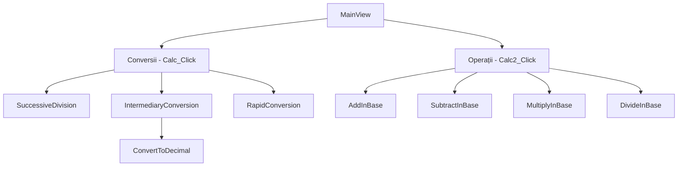

# Logicalc - Calculator pentru conversii și operații în diverse baze numerice

**Autor:** Pîrvulescu Șerban

## I. Enunțul problemei

Dezvoltarea unei aplicații desktop pentru efectuarea conversiilor între baze numerice și realizarea operațiilor aritmetice în diverse baze de numerație. Aplicația trebuie să ofere o interfață intuitivă și să prezinte pașii detaliați ai calculelor pentru scopuri educaționale.

Aplicația va fi compusă din 2 module:
- Conversii între baze numerice
    - Conversie prin împărțiri succesive
    - Conversie prin bază intermediară (baza 10)
    - Conversie rapidă
- Operații aritmetice în baze diferite
    - Adunare în orice bază
    - Scădere în orice bază
    - Înmulțire cu o cifră în orice bază
    - Împărțire cu o cifră în orice bază

Din punct de vedere arhitectural, aplicația este dezvoltată în `.NET/C#` folosind framework-ul `Avalonia`.
Numerele pot fi arbitrar de mari, deoarece se lucrează cu numere mari `BigInteger`.

---

Concret, utilizatorul va introduce numerele într-o casetă de text (`TextBox`), apoi va introduce baza sursă și baza finală în 2 casete de text (`TextBox`).
O casetă de alegeri (`ComboBox`) va permite alegerea metodei de conversie, una din cele 3 menționate mai sus.
Butonul 'Calculează' va lansa subalgoritmii pentru efectuarea calculelor. Opțional, se pot afișa și pașii efectuați prin comutatorul (`ToggleButton`) 'Afișează pași'.

Pentru modulul de operații aritmetice, utilizatorul va introduce numărul, baza și tipul de operație în 3 casete de text (`TextBox`), iar butonul 'Calculează' va lansa subalgoritmii pentru efectuarea calculelor. Opțional, se pot afișa și pașii efectuați prin comutatorul (`ToggleButton`) 'Afișează pași'.

### Diagrama de apel a subalgoritmilor



### Specificarea tipurilor de date folosite

1. **Tipuri de date fundamentale:**
   - `string` - pentru reprezentarea numerelor în diverse baze
   - `BigInteger` - pentru operații cu numere mari
   - `int` - pentru baze și calcule intermediare
   - `char` - pentru cifre individuale
   - `bool` - pentru stări și validări

2. **Tipuri enumerate:**
   ```csharp
   enum BaseConversionType {
       Împărțiri,
       Intermediar,
       Rapid
   }

   enum CalculationType {
       Adunare,
       Scădere,
       Înmulțire,
       Împărțire
   }
   ```

3. **Structuri auxiliare:**
   - `(string, int)` - tupluri pentru stocarea rezultatelor și bazelor

### Subalgoritmii principali

#### 1. Conversii între baze

**ConvertToDecimal(value, baseFrom)**
```
Intrare: value (string) - numărul de convertit
        baseFrom (int) - baza sursă
Ieșire: result (BigInteger) - valoarea în baza 10
        steps (string) - pașii conversiei

result ← 0
Pentru fiecare cifră c din value:
    digit ← GetDigitValue(c)
    Validează digit < baseFrom
    result ← result × baseFrom + digit
    Adaugă pas în steps
Returnează result, steps
```

**SuccessiveDivision(value, newBase)**
```
Intrare: value (string) - numărul în baza 10
        newBase (int) - baza țintă
Ieșire: result (string) - numărul convertit
        steps (string) - pașii conversiei

result ← ""
number ← Parse(value)
Cât timp number > 0:
    remainder ← number mod newBase
    result ← GetDigitChar(remainder) + result
    Adaugă pas în steps
    number ← number ÷ newBase
Returnează result, steps
```

#### 2. Operații aritmetice

**AddInBase(num1, num2, baseVal)**
```
Intrare: num1, num2 (string) - numerele de adunat
        baseVal (int) - baza de calcul
Ieșire: result (string) - suma
        steps (string) - pașii calculului

Alinează numerele la dreapta
carry ← 0
result ← ""

Pentru i de la Length-1 până la 0:
    d1 ← GetDigitValue(num1[i])
    d2 ← GetDigitValue(num2[i])
    sum ← d1 + d2 + carry
    carry ← sum ÷ baseVal
    digit ← sum mod baseVal
    result ← GetDigitChar(digit) + result
    Adaugă pas în steps

Dacă carry > 0:
    result ← GetDigitChar(carry) + result
Returnează result, steps
```

**MultiplyInBase(num1, digit2, baseVal)**
```
Intrare: num1 (string) - primul număr
        digit2 (char) - cifra cu care se înmulțește
        baseVal (int) - baza de calcul
Ieșire: result (string) - produsul
        steps (string) - pașii calculului

multiplier ← GetDigitValue(digit2)
carry ← 0
result ← ""

Pentru i de la Length-1 până la 0:
    d1 ← GetDigitValue(num1[i])
    prod ← d1 × multiplier + carry
    carry ← prod ÷ baseVal
    digit ← prod mod baseVal
    result ← GetDigitChar(digit) + result
    Adaugă pas în steps

Dacă carry > 0:
    result ← GetDigitChar(carry) + result
Returnează result, steps
```

## II. Listă de funcționalități

### A. Conversii între baze numerice
1. Conversie prin împărțiri succesive
2. Conversie prin bază intermediară (baza 10)
3. Conversie rapidă
4. Afișarea pașilor de conversie
5. Suport pentru baze între 2 și 36

### B. Operații aritmetice în baze diferite
1. Adunare în orice bază
2. Scădere în orice bază
3. Înmulțire cu o cifră
4. Împărțire cu o cifră
5. Afișarea pașilor de calcul

## III. Planul de iterații

### Iterația 1: Conversii între baze
- [x] Implementarea algoritmilor de conversie
- [x] Crearea interfeței pentru conversii
- [x] Adăugarea funcționalității de afișare a pașilor
- [x] Validarea datelor de intrare

### Iterația 2: Operații aritmetice
- [x] Implementarea operațiilor de bază
- [x] Crearea interfeței pentru calcule
- [x] Adăugarea funcționalității de afișare a pașilor
- [x] Gestionarea erorilor și validări

### Iterația 3: Îmbunătățiri UI/UX
- [x] Design modern cu gradienți
- [x] Tranziții animate
- [x] Interfață responsivă
- [x] Feedback vizual pentru utilizatori

## IV. Scenarii de rulare

### 1. Conversie între baze
```
Input: 32768 (baza 10) → baza 2
Metodă: Împărțiri succesive
Rezultat: 1000000000000000
Pași vizibili: Nu
```

### 2. Adunare în baza 2
```
Input: 1010 + 1011 (baza 2)
Rezultat:
1010
+ 1011
------
0 + 1 = 1, scriem 1
1 + 1 = 0, scriem 0 și transportăm 1
0 + 0 + transport 1 = 1, scriem 1
1 + 1 = 2, scriem 0 și transportăm 1
Transport final 1
Rezultat 10101
Pași vizibili: Da
```

### 3. Înmulțire în baza 16
```
Input: ABC × 5 (baza 16)
Rezultat: 35BE
Pași vizibili: Nu
```

## V. Lista de activități

### A. Dezvoltare
1. Implementarea algoritmilor de conversie
   - Metoda împărțirilor succesive
   - Metoda bazei intermediare
   - Metoda rapidă
2. Implementarea operațiilor aritmetice
   - Adunare și scădere
   - Înmulțire și împărțire cu o cifră
3. Dezvoltarea interfeței grafice
   - Layout-ul aplicației
   - Componente UI
   - Animații și tranziții

### B. Testare
1. Testarea conversiilor
   - Validarea rezultatelor
   - Verificarea pașilor intermediari
2. Testarea operațiilor
   - Verificarea calculelor
   - Testarea cazurilor limită
3. Testarea interfeței
   - Verificarea responsivității
   - Testarea feedback-ului vizual

### C. Documentare
1. Redactarea documentației tehnice


